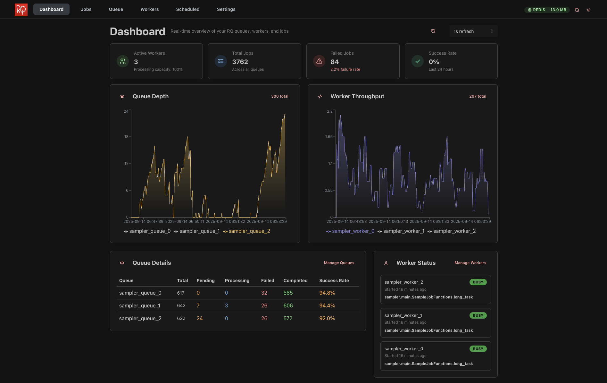

# RQ Manager

A modern, web-based management interface for [Redis Queue (RQ)](https://github.com/rq/rq) with real-time monitoring, analytics, and job management capabilities.

[](https://opensource.org/licenses/MIT)
[](https://www.python.org/downloads/)
[](https://nodejs.org/)



More screenshots available in the [docs/](docs/) folder.

> [!CAUTION]
> This project is in early development. Expect breaking changes and limited production-readiness. Monitor closely.
> Developed and tested with `rq = "^2.5.0"`. Compatibility with other versions is not guaranteed.

## Features

- **Monitor jobs in real-time** – See job status, progress, and history instantly.
- **Manage queues and workers** – Pause, resume, retry, or stop with a click (or in bulk).
- **Analytics at a glance** – Execution times, success rates, performance trends.
- **Prometheus & health checks** – Metrics export and system health status.
- **Modern UI** – Clean, responsive, dark/light theme, live updates.

## Deployment

You can run RQ Manager in different ways depending on your environment. It focus on containerized deployment for simplicity and portability, which basically means single container for all moving parts (API, frontend, db):

- **Docker:**

  ```bash
  git clone https://github.com/ccrvlh/rq-manager.git
  cd rq-manager
  cp .env.example .env
  docker build -t rq-manager .
  docker run -p 7777:7777 --env-file .env \
    -v rq-manager-data:/app/data \
    rq-manager
  ```

- **Kubernetes:**

There are a couple of manifests provided in `infra/k8s/` directory for deploying RQ Manager in a Kubernetes cluster. We've tried to keep it simple and focused on the essential components: deployment, config, pvc, service, secrets.

```bash
kubectl apply -f infra/k8s/
```

For detailed local development setup, see the **Installation** section below.

## Architecture

RQ Manager consists of three main components:

- **Backend API** - Python FastAPI/Litestar application with RQ integration
- **Frontend** - React TypeScript application with modern UI components
- **Analytics Engine** - SQLite-based analytics collection and reporting

## Prerequisites

- **Python 3.12+**
- **Node.js 20+**
- **Redis Server** (for RQ)
- **Docker** (optional, for containerized deployment)

## Installation

### Option 1: Docker (Recommended)

```bash
# Clone the repository
git clone https://github.com/ccrvlh/rq-manager.git
cd rq-manager

# Copy environment configuration
cp .env.example .env

# Edit .env file with your Redis configuration
# RQM_APP_REDIS_HOST=your-redis-host
# RQM_APP_REDIS_PORT=6379

# Build and run with Docker
docker build -t rq-manager .
docker run -p 7777:7777 --env-file .env \
  -v rq-manager-data:/app/data \
  rq-manager
```

### Option 2: Local Development

#### Backend Setup

```bash
# Navigate to API directory
cd api

# Install Poetry (if not already installed)
pip install poetry

# Install dependencies
poetry install

# Copy and configure environment
cp ../.env.example .env
# Edit .env with your configuration

# Run the API server
poetry run rqm api --host 0.0.0.0 --port 8000
```

#### Frontend Setup

```bash
# Navigate to frontend directory
cd front

# Install dependencies
yarn install

# Copy environment configuration
cp .env.example .env.local
# Edit .env.local with your API endpoint

# Start development server
yarn dev
```

### Option 3: Production Deployment

#### Using Docker Compose

```yaml
version: "3.8"
services:
  redis:
    image: redis:7-alpine
    ports:
      - "6379:6379"
    volumes:
      - redis-data:/data

  rq-manager:
    build: .
    ports:
      - "7777:7777"
    environment:
      - RQM_APP_REDIS_HOST=redis
      - RQM_APP_REDIS_PORT=6379
    volumes:
      - rq-manager-data:/app/data
    depends_on:
      - redis

volumes:
  redis-data:
  rq-manager-data:
```

#### Kubernetes Deployment

```bash
# Apply Kubernetes manifests
kubectl apply -f infra/k8s/
```

## Usage

### Web Interface

1. Open your browser and navigate to `http://localhost:7777`
2. The dashboard provides an overview of your RQ system
3. Use the navigation menu to access different sections:
   - **Dashboard** - System overview and key metrics
   - **Jobs** - Job management and monitoring
   - **Queues** - Queue operations and analytics
   - **Workers** - Worker monitoring and management
   - **Analytics** - Historical data and trends

### CLI Interface

RQ Manager includes a command-line interface for advanced operations:

```bash
# Start the API server
rqm api --host 0.0.0.0 --port 8000

# Run analytics collection
rqm analytics --collect

# View help
rqm --help
```

### API Endpoints

The REST API provides programmatic access to all functionality:

```bash
# Get job statistics
curl http://localhost:8000/jobs/counts

# List all queues
curl http://localhost:8000/queues

# Get worker information
curl http://localhost:8000/workers

# Health check
curl http://localhost:8000/health
```

## Configuration

### Environment Variables

All configuration uses the `RQM_` prefix:

```bash
# Application Settings
RQM_APP_ENV=production
RQM_APP_HOST=0.0.0.0
RQM_APP_LOG_LEVEL=INFO

# Redis Configuration
RQM_APP_REDIS_HOST=localhost
RQM_APP_REDIS_PORT=6379
RQM_APP_REDIS_DB=0
RQM_APP_REDIS_PASSWORD=your-password

# Data & Analytics
RQM_APP_ANALYTICS_ENABLED=true
RQM_APP_ANALYTICS_DB_PATH=data/analytics.db
RQM_APP_ANALYTICS_COLLECTION_INTERVAL=1
RQM_APP_ANALYTICS_RETENTION_DAYS=7
```

### Settings File

You can also use `settings.toml` for environment-specific configuration:

```toml
[default]
APP_REDIS_HOST = "localhost"
APP_REDIS_PORT = 6379

[production]
APP_REDIS_HOST = "redis-cluster"
APP_REDIS_PORT = 6379
```

## Data Persistence

RQ Manager uses SQLite to store analytics data & events. To persist this data across container restarts:

### Docker Volume

```bash
# Create a named volume
docker volume create rq-manager-data

# Run with persistent storage
docker run -p 7777:7777 --env-file .env \
  -v rq-manager-data:/app/data \
  rq-manager
```

### Host Directory Mount

```bash
# Create local data directory
mkdir -p ./data

# Run with host directory mount
docker run -p 7777:7777 --env-file .env \
  -v $(pwd)/data:/app/data \
  rq-manager
```

### Kubernetes Persistent Volume

```bash
# Create PVC and mount to deployment
kubectl apply -f infra/k8s/
```

See `infra/k8s/` directory for complete Kubernetes manifests with PVC configuration.

## Monitoring & Metrics

### Prometheus Integration

RQ Manager merged the capability from the `https://github.com/mdawar/rq-exporter` project by `@mdawar`, and exposes Prometheus metrics at `/metrics`:

```bash
# Scrape metrics
curl http://localhost:8000/metrics
```

### Health Checks

Health endpoints for monitoring:

```bash
# Application health
curl http://localhost:7777/health

# API health
curl http://localhost:8000/health
```

## Contributing

We welcome contributions! Please see [CONTRIBUTING.md](CONTRIBUTING.md) for development setup, guidelines, and how to contribute to the project.

## Troubleshooting

### Common Issues

**Connection to Redis fails:**

- Verify Redis is running and accessible
- Check `RQM_APP_REDIS_HOST` and `RQM_APP_REDIS_PORT` settings
- Ensure firewall allows connections

**Frontend can't connect to API:**

- Verify API is running on the correct port
- Check CORS configuration in the backend
- Ensure frontend `.env` has correct API URL

**Jobs not appearing:**

- Confirm RQ workers are connected to the same Redis instance
- Check that jobs are being enqueued to the correct Redis database
- Verify queue names match between RQ and RQ Manager

## License

This project is licensed under the MIT License - see the [LICENSE](LICENSE) file for details.

## Support

- **Issues**: [GitHub Issues](https://github.com/ccrvlh/rq-manager/issues)
- **Discussions**: [GitHub Discussions](https://github.com/ccrvlh/rq-manager/discussions)
- **Documentation**: [Wiki](https://github.com/ccrvlh/rq-manager/wiki)

## Acknowledgments

- [RQ (Redis Queue)](https://python-rq.org/) - The excellent job queue library ([GitHub](https://github.com/rq/rq))
- [Litestar](https://litestar.dev/) - Modern Python web framework
- [Mantine](https://mantine.dev/) - React components library
- [Redis](https://redis.io/) - In-memory data structure store
- [RQ-Exporter](https://github.com/mdawar/rq-exporter) - Original Prometheus metrics exporter for RQ
- [RQ-Dashboard](https://github.com/Parallels/rq-dashboard) - Probably one of the first RQ monitoring solutions
- [RQMonitor](https://github.com/pranavgupta1234/rqmonitor) - Another great monitoring solution
